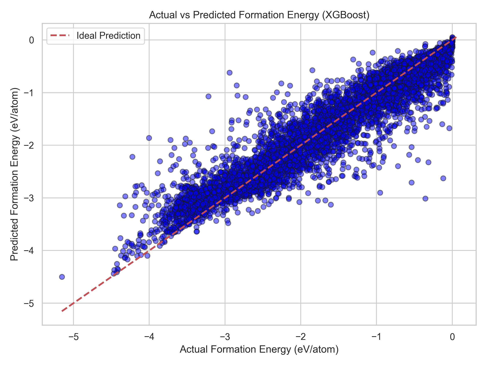
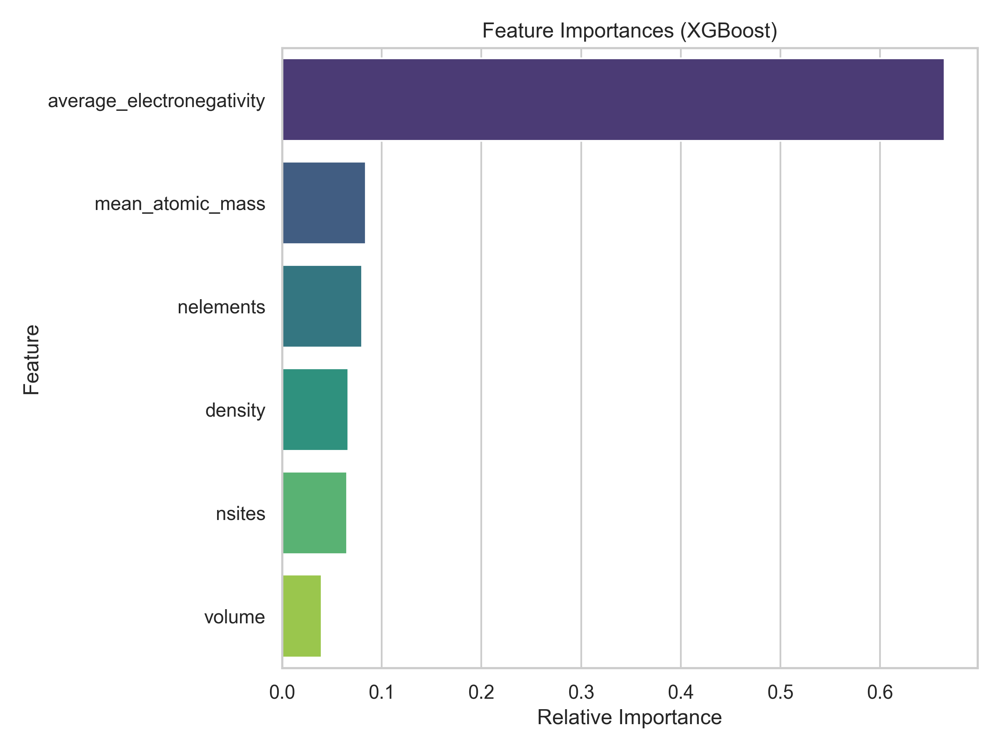
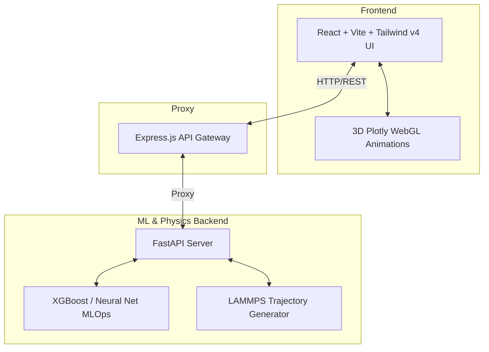

<div align="center">
  <h1>⚛️ AI-Materials-Platform</h1>
  <p><strong>Next-Generation AI + Physics Hybrid Architecture for Materials Discovery</strong></p>

  [](https://python.org)
  [](https://fastapi.tiangolo.com/)
  [](https://reactjs.org/)
  [](https://vitejs.dev/)
  [](https://tailwindcss.com/)
  [](https://expressjs.com/)
</div>

---

## 📖 Overview

The **AI-Materials-Platform** is a cutting-edge hybrid architecture combining advanced Machine Learning operations (MLOps) with fundamental physics simulations. By bridging AI-driven predictions with high-fidelity molecular dynamics, this platform accelerates materials discovery and analysis. 

Our system leverages a tripartite architecture comprising a Python-based MLOps backend for heavy computational modeling, an Express.js proxy for streamlined data routing, and a lightning-fast React frontend for interactive 3D visualizations.

---

## ✨ Features

- 🧠 **MLOps Pipeline:** Comprehensive XGBoost vs. Neural Network training and inference pipeline for predicting material properties.
- 🔬 **LAMMPS Integration:** Direct integration with LAMMPS (Large-scale Atomic/Molecular Massively Parallel Simulator) for robust trajectory generation and molecular dynamics simulations.
- 🧊 **WebGL Visualization:** Interactive, high-performance 3D Plotly animations for exploring molecular trajectories and material structures.
- 🎛️ **Physics Parameter UI:** A beautifully designed, intuitive frontend allowing researchers to tweak complex physics parameters in real-time.

---

## 📊 Machine Learning Analytics

The platform's MLOps pipeline automatically generates professional scientific plots to evaluate the AI's performance on the Materials Project dataset.

<div align="center">
  
  
</div>

---

## 🏗️ Architecture



---

## 🚀 Installation & Startup

To run the platform locally, you will need to start all three servers (ML Backend, Express Proxy, and React Frontend) in separate terminal sessions.

### 1. ML Backend (FastAPI)
This server handles the machine learning models and LAMMPS simulations.
```bash
cd api
# Create a virtual environment (optional but recommended)
python -m venv .venv
# On Windows use: .venv\Scripts\activate
source .venv/bin/activate  

# Install dependencies
pip install -r requirements.txt

# Start the FastAPI server on port 8000
uvicorn main:app --reload --port 8000
```

### 2. Backend Proxy (Express.js)
This server proxies requests from the frontend to the ML backend.
```bash
cd proxy

# Install dependencies
npm install

# Start the dev server
npm run dev
```

### 3. Frontend (React + Vite)
This is the user interface and visualization layer.
```bash
cd frontend

# Install dependencies
npm install

# Start the Vite development server
npm run dev
```

---

## 📖 Citation & Associated Publication

If you use this software or architecture in your research, please cite the following publication:

> **El Macouti, Nour El Haq (2026).** *AI-Materials-Platform: A Full-Stack Hybrid Architecture for Machine Learning and Molecular Dynamics Simulations.* Figshare. 
> DOI: [10.6084/m9.figshare.34245546](https://doi.org/10.6084/m9.figshare.34245546)

**BibTeX:**
```bibtex
@misc{el_macouti_2026,
  author = {El Macouti, Nour El Haq},
  title = {AI-Materials-Platform: A Full-Stack Hybrid Architecture for Machine Learning and Molecular Dynamics Simulations},
  year = {2026},
  publisher = {Figshare},
  doi = {10.6084/m9.figshare.34245546},
  url = {https://doi.org/10.6084/m9.figshare.34245546}
}
```

---

## 🙏 Acknowledgments

Special thanks to the **Most Critical Team** for their relentless dedication to building this platform. 


---
<div align="center">
  <i>Built with 💡 & ⚛️ for the future of materials science.</i>
</div>
